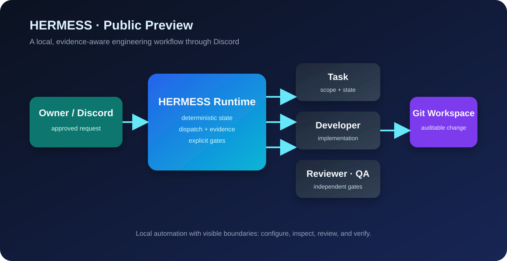

# HERMESS Discord Orchestrator

Run a local AI engineering team through Discord using multiple coding agents, deterministic task state, independent Review, and QA.



HERMESS Discord Orchestrator is a local Runtime that coordinates approved coding Tasks through Discord, SQLite state, and configurable CLI-based Workers. It is an early Public Preview and does not claim autonomous production operation.

## What it does

- Receives approved work through Discord and persists Task state locally.
- Dispatches configurable Worker CLIs while keeping role ownership explicit.
- Separates implementation, independent Review, and rendered/user-facing QA gates.
- Records bounded execution and recovery evidence for local inspection.

## Public Preview status

This release is an early Public Preview, validated on Windows 10/11 and Ubuntu Native for the normal Node/npm Runtime path. Other Linux distributions are not yet explicitly certified. Interfaces, Worker compatibility, recovery behavior, and operational guidance may change. Run it only on a machine and Discord server where you accept local automation risk. Do not use production credentials or production repositories for first setup.

Active feature development is closed for the current project cycle; see
[Maintenance Mode](docs/MAINTENANCE.md) for the supported scope, maintenance
criteria, and non-goals.

## Prerequisites

- Windows 10/11 or Ubuntu Native for the supported normal Node/npm Runtime path.
- Node.js `>=22.13.0` and npm.
- A Discord application/bot with Message Content Intent enabled.
- At least one supported Worker CLI installed and authenticated as the same OS user that runs HERMESS.
- A local Git workspace that the Runtime may access.

## Clone and install

```powershell
git clone https://github.com/ju0o/Hermess-discord-orchestrator.git
Set-Location .\Hermess-discord-orchestrator
npm install
npm run check
```

Ubuntu/Linux shell:

```sh
git clone https://github.com/ju0o/Hermess-discord-orchestrator.git
cd Hermess-discord-orchestrator
npm install
npm run check
```

## Configuration

```powershell
Copy-Item .env.example .env
```

Edit `.env` locally. Never commit it. Set a writable `HERMESS_ROOT`, `HERMESS_PROJECTS_ROOT`, and the Discord bot token variables for the Workers you intend to use. Paths may be absolute or relative to the checkout. Keep the control token unset unless a trusted local caller is required.

Optional JSON examples are in `config/discord-identities.example.json` and `config/project-workspaces.example.json`. Ubuntu/Linux operators may start from `.env.ubuntu.example` and `config/project-workspaces.ubuntu.example.json`; copy them to ignored machine-local locations, replace placeholders, and set `WORKSPACE_REGISTRY_PATH` to the absolute registry path. Do not commit real IDs, tokens, or local workspace paths.

## Discord setup

For each Worker bot:

1. Create an Application and Bot in the Discord Developer Portal.
2. Enable Message Content Intent.
3. Invite the bot with `bot` scope and only the channel/thread permissions it needs: view, send, thread send/history, thread creation, embeds, and attachments.
4. Put the token in the matching local `.env` variable.

The Runtime discovers the connected bot identities. Set `DISCORD_GUILD_ID` only if the Runtime must be restricted to one guild. See `docs/setup/DISCORD_BOTS.md` for the permission details.

## Supported Workers and providers

The current supported Worker surfaces are Codex, Claude Code, OpenCode, and Command Code. Install each CLI separately, authenticate it outside this repository, and set its executable name/path in `.env` (`CODEX_CLI`, `CLAUDE_CODE_CLI`, `OPENCODE_CLI`, `COMMAND_CODE_CLI`). The Runtime does not copy or manage CLI credential files. The optional Hermes control transport is configured with `HERMES_CLI` and the local profile setting.

Use only the Worker/CLI combinations supported by the installed tool. Provider/model availability is reported by health checks and is not assumed from configuration alone.

## Start and verify

For the first run:

```powershell
npm start
```

Ubuntu/Linux uses the same command:

```sh
npm start
```

The process must remain running while Discord is in use. In a second terminal:

```powershell
npm run health
```

```sh
npm run health
```

Health output distinguishes missing CLI authentication, missing bot configuration, and reachable services. A successful HTTP/control response alone is not proof that a Worker completed a Task.

## Stop and restart

In the interactive Runtime terminal, press `Ctrl+C` and wait for the shutdown message. Start it again with `npm start`. Do not kill the process or delete the SQLite files while it is running. The optional Windows logon task is documented in `docs/operations/WINDOWS_24X7.md` and should be configured only after interactive startup works.

## Known limitations

- This is an early Public Preview validated on Windows 10/11 and Ubuntu Native; other Linux distributions are not yet explicitly certified.
- Worker CLI installation, login, model availability, and provider quotas remain external prerequisites.
- Discord bot identity discovery and dynamic workroom behavior are partial.
- Runtime recovery, session restoration, and ambiguous Discord delivery reconciliation are bounded rather than complete.
- Main Hermes integration is optional and is not required for the basic local Runtime path.
- No guarantee is made for unattended operation, production deployment, or arbitrary third-party agents.

## Security and reporting

Never report tokens, cookies, session files, private webhook URLs, or raw private logs in Issues or PRs. For a suspected vulnerability, open a private security report through the repository's GitHub security contact if enabled; otherwise contact the repository maintainers privately before disclosure.

## Contributing

Open an Issue with a minimal reproduction and redacted logs. For changes, use a fork or feature branch, keep the change scoped, add or update focused tests, run `npm run check`, and submit a PR for review. Do not include `.env`, runtime databases, local paths, Discord IDs, or private operational evidence.

## Runtime boundaries

HERMESS uses deterministic Task, Review, QA, and recovery contracts. This public repository stands on its own: internal governance material is not required to install or run this executable preview.
